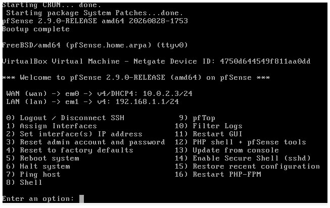
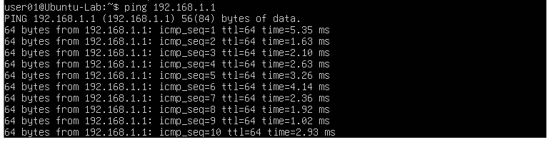
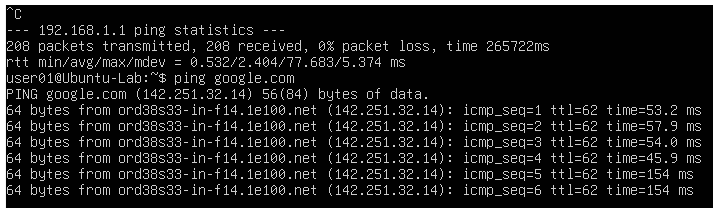
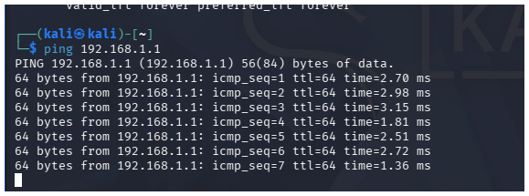
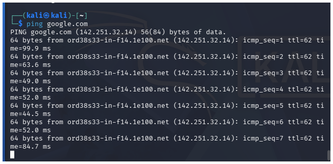

## Lab Build Log
### Day 6-7 VM Foundation
Built two VMs in virtualBox- Ubuntu 25.04 and Kali 2026.2 as the base of the lab. configured, updated, and snapshoted  both.
### Day 13: Network Segementation (pfSense)
Installed pfSense as a virtual router between Ubuntu and Kali using VirtualBox's NAT Network (WAN) and Internal Network (LAN) adapters.
- WAN: DHCP-asigned (10.0.2.x)
- LAN: Static 192.168.1.1/24, DHCP server enabled for clients
- Confirmed routing: Ubuntu and Kali both sucessfully ping pfSense's LAN gateway and reach the internet through it.
  
  
  
  
  
