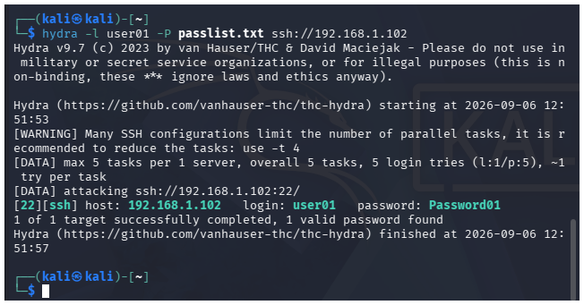
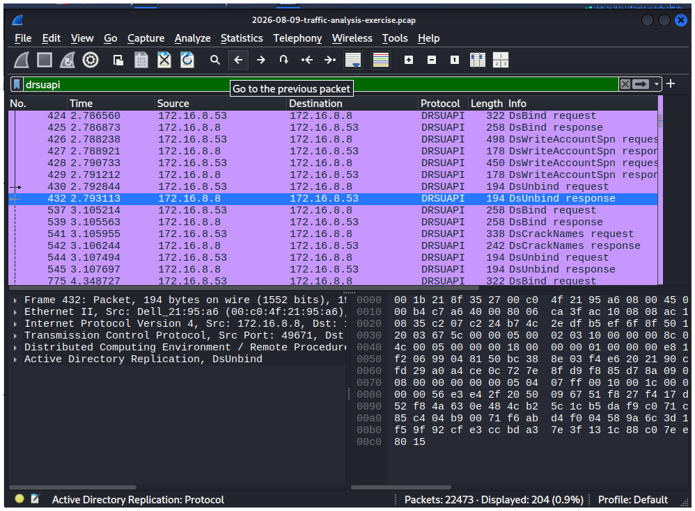
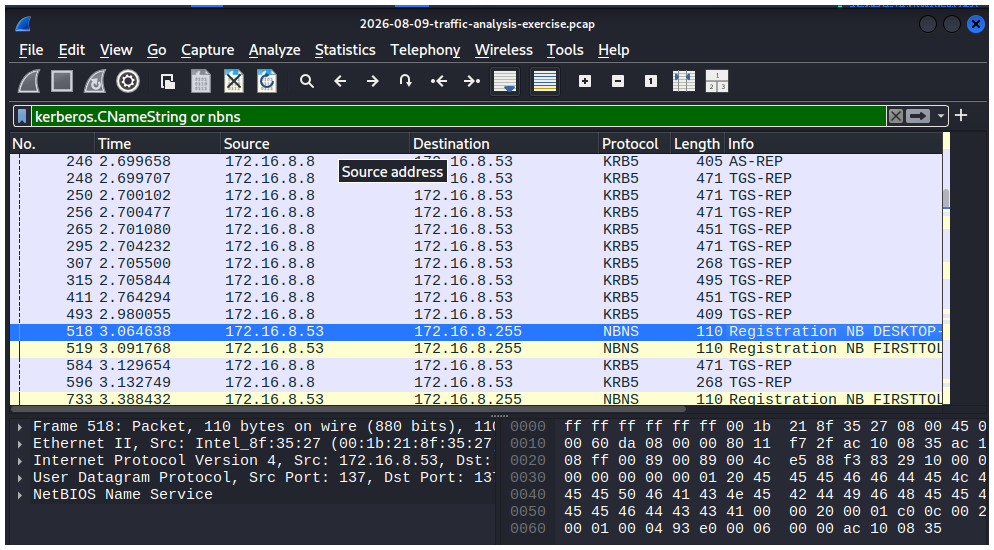

## Lab Build Log
### Day 6-7 VM Foundation
Built two VMs in virtualBox- Ubuntu 25.04 and Kali 2026.2 as the base of the lab. configured, updated, and snapshoted  both.
### Day 13: Network Segementation (pfSense)
Installed pfSense as a virtual router between Ubuntu and Kali using VirtualBox's NAT Network (WAN) and Internal Network (LAN) adapters.
- WAN: DHCP-asigned (10.0.2.x)
- LAN: Static 192.168.1.1/24, DHCP server enabled for clients
- Confirmed routing: Ubuntu and Kali both sucessfully ping pfSense's LAN gateway and reach the internet through it.
  
  
  
  
  
  

### Day 14: Purple Team Lab (Part 1 - Attack Simulation)
Simulated an SSH brute-force attack from Kali against Ubuntu -Lab using Hydra.
- Tool: Hydra v9.7
- Target: 192.168.1.102:22 (SSH)
- Result: Successfully compromised credentials in 4 seconds
- MITRE ATT&CK: T1110.001 (Password Guessing)
  Detection and response writeup to follow in week 6 once SIEM is built.
  
  

### Day 20: Wireshark pcap Analysis
Analyzed a real-world training pcap to identify anomalous Active Directory Replication traffic.
- Source: 172.16.8.53 (workstation, hostname registered as Desktop-snlv63k via NBNS)
- Target: 172.16.8.8 (domain controller)
- Finding: Repeated DRSUAPI DsBind/DsCrackedNames calls from a workstation to a DC-abnormal, since AD replication should only occur DC-to -DC
- MITRE ATT&CK: T1087.002 (Account Discovery: Domain Account)
- Source: malware-traffic-analysis.net (2026-08-09 exercise)

  
  
  
  
  
