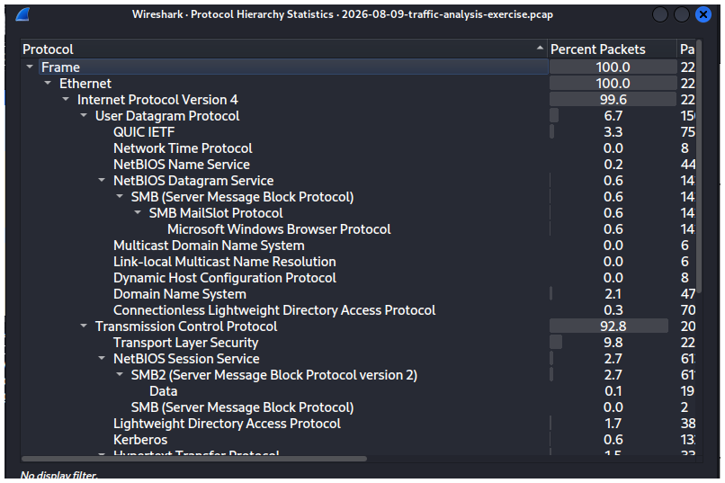
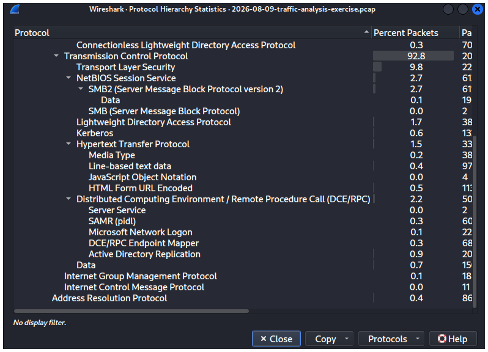
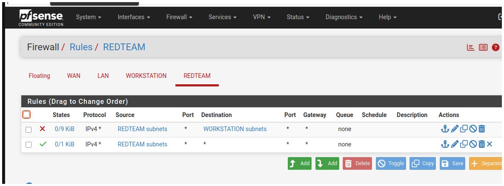
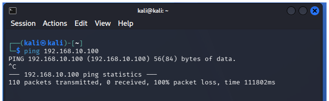
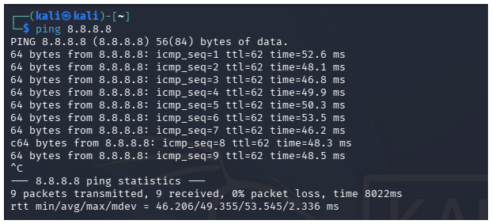

## Lab Build Log
### Day 6-7 VM Foundation
Built two VMs in virtualBox- Ubuntu 25.04 and Kali 2026.2 as the base of the lab. configured, updated, and snapshoted  both.
### Day 13: Network Segementation (pfSense)
Installed pfSense as a virtual router between Ubuntu and Kali using VirtualBox's NAT Network (WAN) and Internal Network (LAN) adapters.
- WAN: DHCP-asigned (10.0.2.x)
- LAN: Static 192.168.1.1/24, DHCP server enabled for clients
- Confirmed routing: Ubuntu and Kali both sucessfully ping pfSense's LAN gateway and reach the internet through it.
  
  
  
  
  
  

### Day 14: Purple Team Lab (Part 1 - Attack Simulation)
Simulated an SSH brute-force attack from Kali against Ubuntu -Lab using Hydra.
- Tool: Hydra v9.7
- Target: 192.168.1.102:22 (SSH)
- Result: Successfully compromised credentials in 4 seconds
- MITRE ATT&CK: T1110.001 (Password Guessing)
  Detection and response writeup to follow in week 6 once SIEM is built.
  
  

### Day 20: Wireshark pcap Analysis
Analyzed a real-world training pcap to identify anomalous Active Directory Replication traffic.
- Source: 172.16.8.53 (workstation, hostname registered as Desktop-snlv63k via NBNS)
- Target: 172.16.8.8 (domain controller)
- Finding: Repeated DRSUAPI DsBind/DsCrackedNames calls from a workstation to a DC-abnormal, since AD replication should only occur DC-to -DC
- MITRE ATT&CK: T1087.002 (Account Discovery: Domain Account)
- Source: malware-traffic-analysis.net (2026-08-09 exercise)

  
  
  
  
  
### Day 27-28: VLAN Segmentation and Network Isolation
Configured 802.1q VLANS on pfSense to segment Ubuntu ("Workstation, "VLAN 10) and Kali ("RedTeam, "VLAN 20) into isolated network zones with firewall-enforced inter-VLAN restrictions.
- Created VLAN-tagged sub-interfaces on pfSense (em1.10, em1.20) with seperate subnets, DHCP pools, and firewall rulesets per zone.
- Configured Linux VLAN tagging on both VMs (802.1Q kernel module) so guest traffic correctly tagged with the matching VLAN ID
- Implemented a Block rule (RedTeam \u2192 Workstation net) above a Pass rule (RedTeam \ u2192 Any0, enforcing one-way isolation while preserving internet access.

**Troubleshooting:** Intial testing shiwed cross-VLAN trafic still passing despite a correctly-ordered block rule. Diagnosis via 'ip route' on Kali revealed a legacy untagged interface route still active alongside the new VLAN-tagged interface, causing traffic to bypass pfSense's VLAN enforcement entirely. Resolved by removing the stale default route, forcing all traffic through the tagged interface where firewall rules correctly applied.

**Result:** Confirmed RedTeam VLAN fully isolated from Worksataions VLAN (100% packet loss cross-VLAN) while retaining internet access (0% packet loss to 8.8.8.8)

  
  
  
